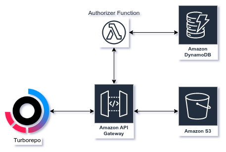

# Turborepo S3 Cache


Serverless Turborepo remote cache using API Gateway and S3.

## Description

An in-depth paragraph about your project and overview of use.


## Getting Started

1. Clone this repo

   ```sh
   git clone git@github.com:gpdenny/turborepo-s3-cache.git
   ```

2. Install dependencies

   ```sh
   yarn install
   ```

3. Copy example environment variables

   You can do this for each environment you might wish to deploy to, for example, dev.

   ```sh
   cp .env.example .env.dev
   ```

4. Modify environment variables to your requirements

- `SERVICE_NAME` - Serverless service name, used to prefix all AWS resources
- `REGION` - The AWS Region to deploy the service to
- `TEAMS_TABLE_NAME` - Name for the DynamoDB teams table [see below](#item6)
- `CACHE_BUCKET_NAME` - Name for the artifacts S3 bucket
- `API_GW_LOGS` - [true/false] - Should API Gateway logging be enabled

5. Run Serverless deploy

   Include the stage flag, with the environment you wish to deploy.

   ```sh
   yarn serverless deploy --stage dev
   ```

6. Populate the Teams DynamoDB table

   ```sh
   aws dynamodb put-item \
       --table-name `TEAMS_TABLE_NAME`  \
       --item \
           '{"name": {"S": "myteam"}, "tokens": {"S": "[\"token1\", \"token2\"]"}}'
   ```

7. Add remote cache to your Turborepo config

   `.turbo/config.json`

   ```json
   {
       "teamId": "team_myteam",
       "apiUrl: "https://fxbu8kd8i.execute-api.eu-central-1.amazonaws.com/dev/"
   }
   ```

   `package.json`

   ```json
   [...]
   "lint": "turn run lint --token'\"token1\""
   [...]
   ```
   [Read More](https://turbo.build/repo/docs/core-concepts/remote-caching#custom-remote-caches)


## Authors

[Gareth Denny](https://twitter.com/gazdenny)

## Acknowledgments

Inspiration, code snippets, etc.

- [turborepo-remote-cache](https://github.com/ducktors/turborepo-remote-cache)
- [Serverless Apigateway Service Proxy](https://www.serverless.com/plugins/serverless-apigateway-service-proxy)
- [Tommy Parnell](https://blog.terrible.dev/Building-a-remote-cache-server-for-Turborepo/)
