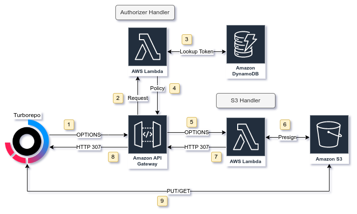

# Turborepo S3 Cache

Serverless Turborepo remote caching using API Gateway and S3.

## Description

This project is a serverless implementation of the [Turborepo custom remote cache server](https://turbo.build/repo/docs/core-concepts/remote-caching#custom-remote-caches).

It uses API Gateway as a proxy for storing cache artifacts in S3 and Dynamodb to provide basic authentication.

Build and Deployment is managed by the [Serverless Framework](http://serverless.com/) for ease of use.

## Getting Started

### Dependencies

## Authors

[Gareth Denny](https://twitter.com/gazdenny)

## Acknowledgments

Inspiration, code snippets, etc.
* [turborepo-remote-cache](https://github.com/ducktors/turborepo-remote-cache)
* [Serverless Apigateway Service Proxy](https://www.serverless.com/plugins/serverless-apigateway-service-proxy)
* [Tommy Parnell](https://blog.terrible.dev/Building-a-remote-cache-server-for-Turborepo/)